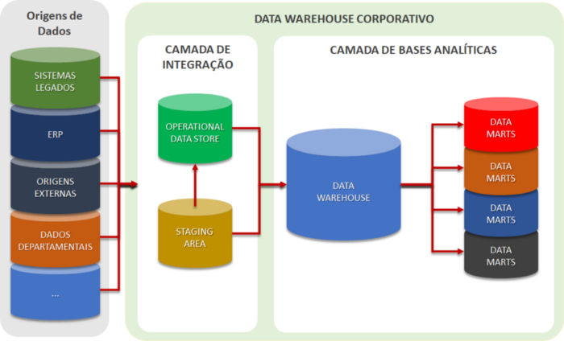

# Conceitos de Data Mart e Data Warehouse

## Data Mart (DM)

De forma geral, um _data mart_ é um sistema de armazenamento de dados que contém informações específicas de uma área de negócios de uma empresa ou organização. Ele contém uma parte menor e isolada dos dados que a empresa armazena em um sistema de armazenamento maior (_Data Warehouse_). As empresas usam um data mart para analisar informações específicas de cada área com mais eficiência.

Por exemplo, uma empresa pode armazenar dados de várias fontes: para a área de vendas, podem ser armazenadas informações de pedidos, clientes, fornecedores, funcionários e transações financeiras, formando um _data mart_, que pode estar inserido dentro de um _data warehouse_. Para a área de marketing, a empresa pode armazenar informações para o departamento de marketing, como análises de mídias sociais e registros de clientes, em um outro data mart, caracterizando mais uma parte de um data warehouse.

Portanto, o _data mart_ (DM) é um banco de dados que representa um segmento de um _data warehouse_ (DW), este que pode ser representado como um "subconjunto de dados" dentro do conjunto do DW, que possui regras de negócios e cálculos específicos. Enquanto o DW é criado para servir como o armazenamento central de dados para toda a empresa, o _data mart_ atende à solicitação de uma divisão ou função comercial específica.

Com base em seus requisitos, pode-se usar vários _data marts_ para diferentes departamentos e optar pela consolidação de um repositório de dados central (DW) mesclando diferentes DM.

Se pensarmos no banco de dados de uma empresa, um DM vai ter dados apenas de um departamento (financeiro, jurídico, RH, entre outros).

## Características do _data mart_

- Um _data mart_ usa um esquema em estrela (_star schema_) para projetar tabelas (para mais informações sobre este tema, verifique o curso **Introdução à Modelagem Dimensional**, aqui mesmo no ITC);
- Projetar e usar um _data mart_ é comparativamente mais simples que um _data warehouse_ devido ao seu tamanho pequeno (geralmente, com menos de 100 GB);
- Um _data mart_ tem dimensões menores e os dados são integrados a partir de um número menor de origens;
- Um _data mart_ carrega dados relacionados a um departamento, como RH, marketing e finanças, etc., estando cada uma das áreas em um _data mart_ isolado.

> _"O Data Mart pode ser considerado como um Data Warehouse pequeno, de implementação rápida focado nos dados de uma área específica e orientado a soluções de problemas de negócio específicos.”_ – Patricia Seybold

## _Data Warehouse_ (DW)

Um Data Warehouse é formado basicamente por um conjunto de Data Marts. O Data Warehouse é criado para ser o centralizador de dados de uma empresa.

Geralmente um DW é criado com modelagem dimensional por ser um banco que não atende especificamente um sistema transacional.

## Características de um Data Warehouse

- **Organização**: Através de metadados, os dados são organizados por assunto e contêm as informações relevantes para as melhores tomadas de decisão.

- **Consistência**: - Os dados passam pelo sistema de integração, do ambiente operacional para as aplicações do data warehouse. Sendo assim, a codificação é consistente e padronizada.

- **Variedade de tempo**: O data warehouse armazena os dados, em média, de 5 a 10 anos, para que seja possível avaliar tendências, realizar análises históricas, entre outros motivos. Depois desse tempo, os dados operacionais externos são limpos, para remover as inconsistências e, em seguida, integrados, para criar um banco de dados mais ajustado à análise corporativa.

- **Não volatilidade**: Os dados inseridos no data warehouse, antes de serem carregados, são filtrados e não recebem nenhum tipo de atualização ou alteração. Eles ficam à disposição somente para leitura ou exclusão.

> Um bom material complementar para entender Data Warehouses pode ser encontrado [neste link](https://www.oracle.com/br/database/what-is-a-data-warehouse/) da Oracle.
