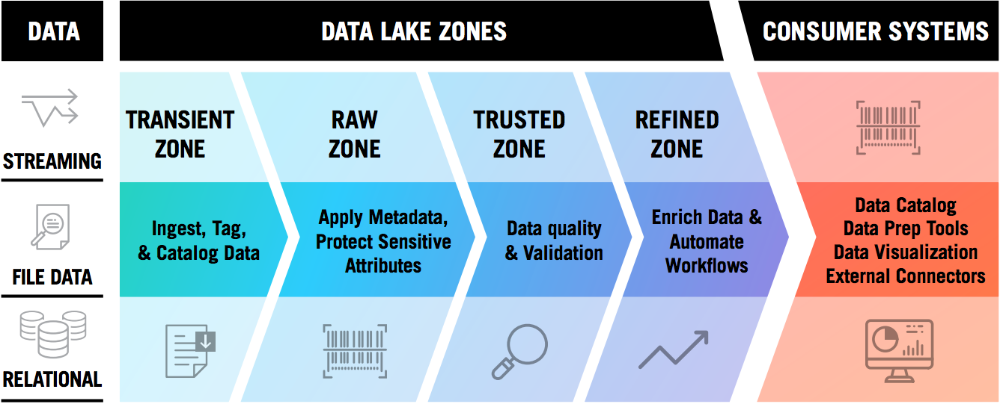
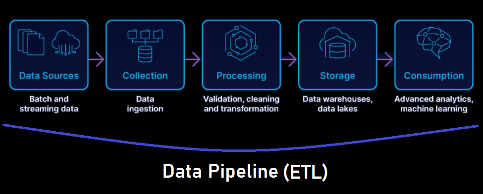

# Processos do ETL

Os processos de ETL, divididos em _Staging Area_ (Camada _Bronze_), _Raw Area_ (Camada _Silver_), _Trusted Area_ (Camada _Gold_) e _Refined Area_— podendo as áreas serem chamadas de _zones_, _zonas_ ou camadas —, são, em ordem, os principais estágios do ETL. Mais detalhes de cada área estão descritos abaixo.

## 1º processo: _Staging Area_ — Camada _Bronze_

Um dos aspectos fundamentais a considerar na criação de _Data Warehouses_ é a consolidação de dados de diferentes origens, quer sejam sistemas ou áreas distintas.

A _Staging Area_ é uma zona transitória, na qual os dados serão ingeridos pelo _data lake_. É a camada inicial do _data lake_ onde os dados são recebidos de diferentes fontes, incluindo bancos de dados, arquivos, aplicativos e dispositivos IoT (Internet das Coisas). Nesta camada, os dados são recebidos em sua forma bruta e não processada, sem nenhuma transformação ou limpeza adicional.

Criar uma _Staging Area_ ajuda na organização e na confiabilidade dos dados finais. Geralmente, após o final do processo de _staging_, os dados armazenados nessa etapa são apagados, e seguem para o segundo processo de ETL, a _Raw Area_, ou _Camada Silver_.

## 2º processo: _Raw Area_ — Camada _Silver_

Nossa área, pode-se armazenar com agilidade todos os dados de fontes relevantes, independente de quanto será consumido de imediato. Os dados da camada Bronze (_Staging Area_), aqui na Raw Area, são persistidos com a mesma estrutura dos dados recebidos da STG, porém estão em seus estado bruto, ainda não recebendo os tratamentos necessários para serem consumidos em análises tradicionais.

O principal objetivo é ingerir dados na _Raw Area_ da maneira mais rápida e eficiente possível. Para isso, os dados devem permanecer em seu formato nativo. Não são permitidos quaisquer transformações nesta fase. Com o dados na _Raw Area_, podemos voltar a um ponto no tempo, pois o arquivo é mantido, caso seja necessária uma reestruturação dos dados tratados na _Trusted Area_, que é a seguinte após a _Raw Area_. Nenhuma substituição é permitida, o que significa lidar com duplicatas, mudações de schema ou estrutura e versões diferentes dos mesmos dados.

Apesar das restrições acima, os dados na _Raw Area_ ainda precisam ser organizados em pastas. Uma divisão genérica desses diretórios (pastas) é a seguinte: área de assunto/fonte de dados/objeto/ano/mês/dia da ingestão dos dados brutos. É importante mencionar que os usuários finais não devem ter acesso a esta camada. Os dados aqui não estão prontos para serem usados, E requerem muito conhecimento em termos de consumo e ingestão adequadas.

## 3º processo: _Trusted Area_ — Camada _Gold_

É a área que irá receber os dados já com algum tratamento, seja padronizando dados, tipos, uso ou não de máscaras e / ou agregações, onde tais tratamentos são definidos pela área de negócio para seu consumo, seja para definição de _reports em BI_ ou processos em _Data Science_ e _Analytics_. É a área em que as estruturas são estabelecidas em Modelagem Dimensional (tabelas fato e dimensão — para mais detalhes, verifique o curso _Introdução à Modelagem Dimensional_, aqui do ITC).

Em resumo, nesta camada os dados passam por processos de validação, verificação e limpeza para garantir sua qualidade e integridade. Os dados são normalizados (através das tabelas dimensão), padronizados e organizados de acordo com um esquema pré-definido, o que ajuda a melhorar sua qualidade e confiabilidade. Nesta camada, é possível adicionar metadados aos schemas, tabelas e dados para facilitar a busca e a análise.

## 4º processo: _Refined Area_

Sendo esta área opcional, dependendo das ferramentas utilizadas (não necessariamente precisando ser incluída no processo de ETL, caso seja possível utilizar uma ferramenta como o _Databricks_, que unifica o processo de engenharia e de análise de dados, sendo, neste exemplo de ferramenta, possível a consulta dos dados já através da camada _Gold_), é a camada final do _data lake_, onde os dados são recebidos da _Trusted Area_ para realização análises e visualizações, e armazenados em um _Data Warehouse_.

Nesta camada, os dados são representados pelo resultado dos schemas, dados e tabelas  definidos na _Trusted Area_, sendo uma camada para armazenamento dos dados em um _Data Warehouse_.

## Operational Data Store

O _Operational Data Store_ é um repositório de dados que visa atender consultas detalhadas e personalizadas pelos usuários. Normalmente se mantém em modelo relacional (modelo padrão _OLTP_ _Online Transaction Processing_ — dados transacionais em níveis operacionais de um negócio), não sendo transformados no padrão _OLAP_ (_Online Analytical Processing_ — modelo adaptado, através dos processos de ETL, para a formação de um _data warehouse_).

Ao contrário da (_Staging Area_), a ODS (_Operational Data Store_) é persistente entre as cargas. E, diferentemente da _Raw Area_, é possível permitir o acesso aos usuários finais ou áreas de negócio, recebendo  tratamentos personalizados para suas necessidades. No ODS, é recomendado:

- Quando há necessidade de detalhamento e transformação, para relatórios, processos de _data science_ ou consultas, não suportados por modelo dimensional, necessitando algo personalizado por meio do acesso direto as origens;

- Quando há necessidade de manter os dados para permitir atualizações e reconstrução do _data warehouse_, evitando a volatilidade na origem;

- Quando são necessários processos complexos de uniformização, regularização, padronização, transformação ou união mínimas de informações de múltiplas origens regulares (da organização) ou mesmo de origens não regulares (dados externos, não sistematizados na organização).

### Características de uma _Operational Data Store_ (ODS)

As tabelas que compõem um _operational data store_ se caracterizam basicamente por:

- **Uso de chaves de negócio:** no ODS, não são criadas _surrogate keys_ (chaves únicas, criadas na _Trusted Area_ no processo de ETL para tabelas fato) nas tabelas, mas podem ser necessárias chaves de unificação para integrar e diferenciar dados de origens distintas;

- **Grão detalhado de informação:** Os dados permanecem no nível necessário para atender às consultas a que se destina. Normalmente permanece o nível mais baixo;

- **Informação consistente:** no ODS, não se deve armazenar dados parciais, agregados ou incompletos, pois isso é função da _Trusted Area_;

- **Não exigir normalização:** a área ODS, embora relacional, admite modelo desnormalizado para ganho de performance e personalização de consultas pelas áreas de negócio;

- **Mantém relação com a origem:** o ODS deve permitir rastrear a informação até a sua origem, mantendo registro das chaves de negocio originais e fontes, se necessário;

- **Base voltada a leitura:** admite artifícios de aceleração como índices, e a já mencionada desnormalização. Por ser originada dos sistemas OLTP, em tese íntegros, da empresa, a necessidade de integridade referencial é relegada apenas à garantia da qualidade do ETL desenvolvido.

### Benefícios da Adoção de uma Camada ODS

- Dados unificados e padronizados de diferentes origens;

- Possibilidade de geração de relatórios mais elaborados e personalizados, por conta de dados mais detalhados, que podem ser agregadas, aplicando técnicas de armazenamento, como os _snapshots_ (visões fotográficas da base);

- Independência processual da origem e dos processos de ETL, evitando a concorrência com os recursos produtivos;

## Camada Semântica (aplicação na _Trusted Area_)

Vamos primeiro entender o que significa a palavra “_semântica_”.  

> Semântica é o estudo do significado das palavras e conceitos.

### Então, o que seria a camada semântica?

A camada semântica é a camada onde “traduzimos” os dados de uma forma em que os usuários de negócio entendam e consigam tomar decisões.

Quando criamos um _data warehouse_, geralmente utilizamos nomenclaturas próprias e de acordo boas práticas para visualização otimizada pelas áreas de negócio.

> **Por exemplo:** _CodProduto_. Apesar de o usuário de negócio conseguir entender o conceito, ficaria mais fácil se esta informação retornasse como _Código do Produto_.

Camada semântica é basicamente uma camada de negócio. É realizada no final do processo de ETL, na _Trusted Area_, no nível de visualização dos dados.

Importante ressaltar que em ciência de dados, o conceito de camada semântica é bem mais elevado e usado de formas diferentes, porém, isso é assunto para um próximo estudo.

## _Pipeline_ de dados - integração dos processos de ETL

### O que é um _pipeline_ de dados?

Trata-se de um conjunto de etapas que levam dados do ponto A ao ponto B. Em relação às camadas do ETL, mencionadas acima, o _pipeline_ integra todos as camadas, desde a _Staging Area_ (Camada _Bronze_), _Raw Area_ (Camada _Silver_), _Trusted Area_ (Camada _Gold_) até a _Refined Area_. Ou seja, o _pipeline_ é a ferramenta que ordena esses processos e os executa na ordem correta, a fim de automatizar a carga entre esses processos e fazê-los executar de maneira programada e constante. O ponto inicial é o lugar onde os dados são gerados — a _Staging Area_ e _Raw Area_, sendo o destino final, sendo essa a _Trusted Area_ e / ou a _Refined Area_.

Os dados passam por transformações e integrações, a fim de que cheguem prontos ao destino para aplicação na finalidade desejada, de forma automatizada e programada.

### Definição dos _pipelines_

O engenheiro de dados, portanto, define o que deve ser processado, e como, em cada uma das etapas, executando primeiramente o pipeline (a automatização da execução dessas etapas) de forma manual (a fins de teste, para armazenamento em ambiente de desenvolvimento), e, após os testes necessários, aplicar essa programação definida nos pipelines em ambiente de produção, com a execução programada conforme as necessidades dos usuários.

O _pipeline_ de dados recebe, portanto, dados brutos e, na sequência, promove a limpeza e o redirecionamento deles. Por fim, executa cálculos ou agregações antes de armazenar os dados processados, que são consumidos pelos clientes, relatórios ou APIs (_Application Programming Interfaces_ ou Interfaces de Programação de Aplicação).

### Algumas ferramentas para desenvolvimento e execução de pipelines de dados

Baseadoos em nuvem:

- AWS Glue;
- Azure Data Factory;
- Google Cloud Platform.

Baseados em sistemas _on-premises_:

- Airflow;
- Azkaban;
- Luigi.
